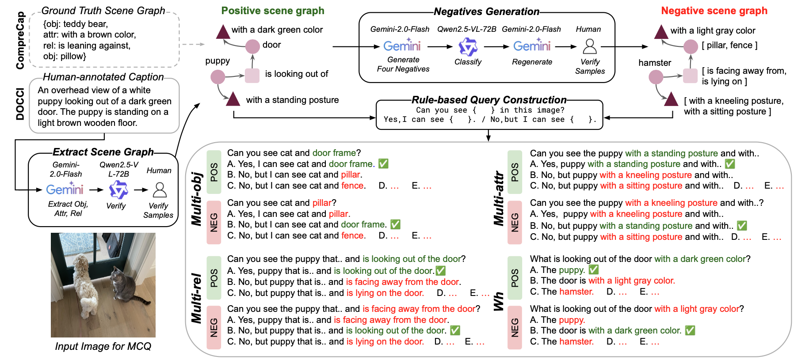
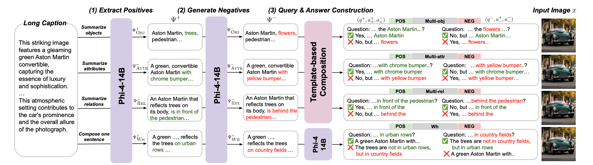

# [CVPR 2026 Oral] FINER: MLLMs Hallucinate under Fine-grained Negative Queries
[](https://arxiv.org/abs/2603.17662)
[](https://explainableml.github.io/finer-project/)
[](https://huggingface.co/collections/xiaorui638/finer-models)
[](https://huggingface.co/datasets/xiaorui638/FINER-Tuning-data)

**Authors:** [Rui Xiao](https://www.eml-munich.de/people/rui-xiao), [Sanghwan Kim](https://kim-sanghwan.github.io/), [Yongqin Xian](https://xianyongqin.github.io/), [Zeynep Akata](https://www.eml-munich.de/people/zeynep-akata), [Stephan Alaniz](https://www.telecom-paris.fr/)

## News
- **[2026-04-08]** 🎉 Our paper was accepted to **CVPR 2026** as an **Oral Presentation**.


## Abstract
Multimodal large language models (MLLMs) struggle with hallucinations, particularly with fine-grained queries, a challenge underrepresented by existing benchmarks that focus on coarse image-related questions. We introduce FIne-grained NEgative queRies (FINER), alongside two benchmarks: FINER-CompreCap and FINER-DOCCI. Using FINER, we analyze hallucinations across four settings: multi-object, multi-attribute, multi-relation, and “what” questions. Our benchmarks reveal that MLLMs hallucinate when fine-grained mismatches co-occur with genuinely present elements in the image. To address this, we propose FINER-Tuning, leveraging Direct Preference Optimization (DPO) on FINER-inspired data. Finetuning four frontier MLLMs with FINER-Tuning yields up to 24.2% gains on hallucinations from our benchmarks, while simultaneously improving performance on eight existing hallucination suites and enhancing general multimodal capabilities across six benchmarks.

## Methodology
We refer to our [project page](https://explainableml.github.io/finer-project/), where we walk you through the paper in details.

### FINER-Benchmarks


### FINER-Tuning


## Pre-trained Models

We released the pre-trained FINER models on [Huggingface](https://huggingface.co/collections/xiaorui638/finer-models).

## Training

We finetune frontier MLLMs with **Direct Preference Optimization (DPO)** on the released
[FINER-Tuning data](https://huggingface.co/datasets/xiaorui638/FINER-Tuning-data), built on top of
[LLaMA-Factory](https://github.com/hiyouga/LLaMA-Factory). The [`train/`](train) folder provides everything
needed: data-preparation scripts ([`prepare_training_data.py`](train/prepare_training_data.py),
[`generate_training_data/`](train/generate_training_data), [`sample_training_data/`](train/sample_training_data))
and the LLaMA-Factory training code with example `sbatch` scripts.

A typical workflow is: set up the LLaMA-Factory environment → prepare the FINER-Tuning data → launch
training for one of the four model families (Qwen2.5-VL, InternVL3.5-8B/14B, LLaVA-1.6-7B).

> 📖 See **[train/README_train.md](train/README_train.md)** for detailed, step-by-step instructions
> (environment, data preparation, and launching training).

## Evaluation

All evaluation code lives under [`eval/`](eval) and runs in a single environment.

### 1. Environment

We evaluate through [VLMEvalKit](https://github.com/open-compass/VLMEvalKit). Set up its environment by
following its own requirements — nothing special beyond that:

```bash
cd eval/VLMEvalKit
pip install -e .   # or follow eval/VLMEvalKit/README.md / requirements.txt
```

The provided SLURM scripts assume a conda environment named `vlmeval`.

### 2. Prepare datasets

> 📖 Detailed instructions for downloading and arranging each evaluation dataset are in
> **[eval/Prepare_datasets.md](eval/Prepare_datasets.md)**.

### 3. Run the evaluations

**FINER benchmarks — FINER-CompreCap / FINER-DOCCI** ([`eval/finer_benchmarks/`](eval/finer_benchmarks)).
Multiple-choice inference via `inference.py`. FINER-CompreCap bundles images directly in the HF dataset
(recommended); FINER-DOCCI (our large-scale study) provides image filenames only, so download the DOCCI images and pass `--images`:

```bash
cd eval/finer_benchmarks

# FINER-CompreCap (images bundled in the HF dataset)
python inference.py --model_type qwen2_5_vl --model <hf-or-local-model-path> \
  --hf_dataset xiaorui638/finer-comprecap-mcq --hf_split multi_obj --out preds.csv
# splits: multi_obj | multi_attr | multi_rel | wh

# FINER-DOCCI (download DOCCI images, then pass --images)
python inference.py --model_type qwen2_5_vl --model <hf-or-local-model-path> \
  --hf_dataset <docci-mcq-repo> --images /path/to/docci/images --out preds.csv
```

`--model_type` choices: `qwen2_5_vl | internvl | llava_next`. The script writes predictions and prints
paired accuracy.

We also provide example inference bash scripts in `eval/finer_benchmarks/scripts`, please feel free to use them.

**POPE / RePOPE / DASH-B** ([`eval/pope_repope_dash/`](eval/pope_repope_dash)):

```bash
cd eval/pope_repope_dash

# POPE + RePOPE (needs COCO val2014 images + annotation JSONs)
python run_pope_repope.py --model_type qwen25vl \
  --ann_dir <annotations_dir> --coco_images <coco_val2014_dir> --out_dir out/

# DASH-B (auto-downloads YanNeu/DASH-B from Hugging Face)
python run_dash.py --model_type qwen25vl --out dashb_preds.csv
```

`--model_type` choices here: `qwen25vl | internvl35 | llava_next`. Both scripts support `--lora_dir` and
`--merge_lora`.

**Existing hallucination & general benchmarks** ([`eval/VLMEvalKit/`](eval/VLMEvalKit)). Run suites such as
AMBER, HallusionBench, CRPE_RELATION, MMStar, TextVQA, ChartQA, MMVP, NaturalBench, and VStarBench through
VLMEvalKit's `run.py`. See the example scripts (`FINER-Qwen2_5-VL-7B.sh`, `FINER-InternVL3_5-8B-Custom.sh`, …):

```bash
cd eval/VLMEvalKit
bash FINER-InternVL3_5-8B-Custom.sh
```
Note: For the InternVL-series, we converted their weights from the huggingface format to InternVL's custom format in order to fit into the suage of `VLMEvalKit`. So [FINER-InternVL3_5-8B-Custom](https://huggingface.co/xiaorui638/FINER-InternVL3_5-8B-Custom) and [FINER-InternVL3_5-8B](https://huggingface.co/xiaorui638/FINER-InternVL3_5-8B) are inherently the same.

## Citations
If you find our work useful, please star this repo and cite:

```bibtex
@inproceedings{xiao2026finer,
  title={FINER: MLLMs Hallucinate under Fine-grained Negative Queries},
  author={Xiao, Rui and Kim, Sanghwan and Xian, Yongqin and Akata, Zeynep and Alaniz, Stephan},
  booktitle={CVPR},
  year={2026}
}
```
